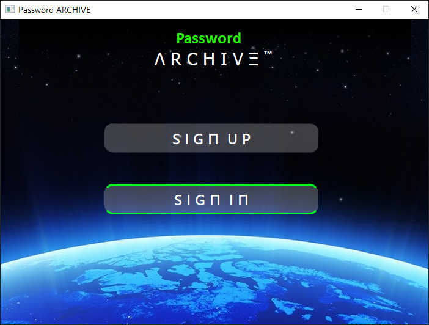

# Password Archive 
_One place to store all your passwords_
- --

## **Dependencies**

### Python
 * Download and install Python from [here.](https://www.python.org/downloads/) 

### Qt FrameWork
<!--Github-->
**For Windows 10, Mac OS and Linux**
Open the command prompt and paste the following command
```bash
pip3 install pyqt5
```
---
## **Usage** :
>### Step 1
>>**Create an account or Sign in if you already have one.**

>### Step 2 
>>**Create an account by providing the following details.**

>### Step 3 
>>**Login to your accout using the Master password. (You only need to remember this password)**

>### Step 4 
>>**You have the list of all the passwords that are stored.**

>### Step 5 
>>**Press the "+" button to add a new credential.**


---
